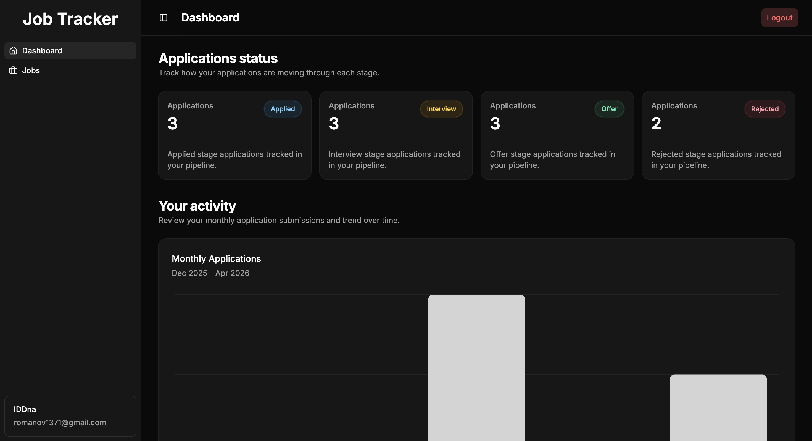
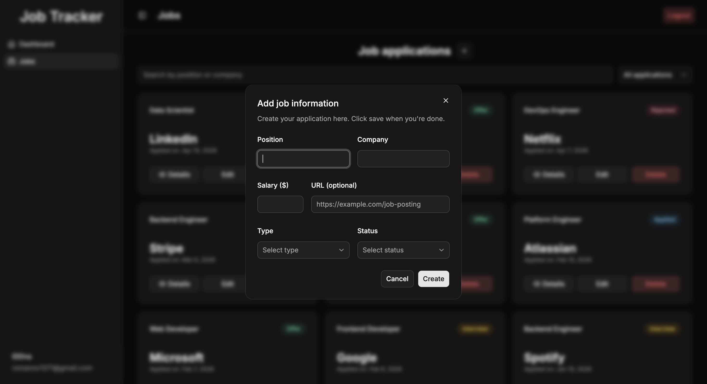
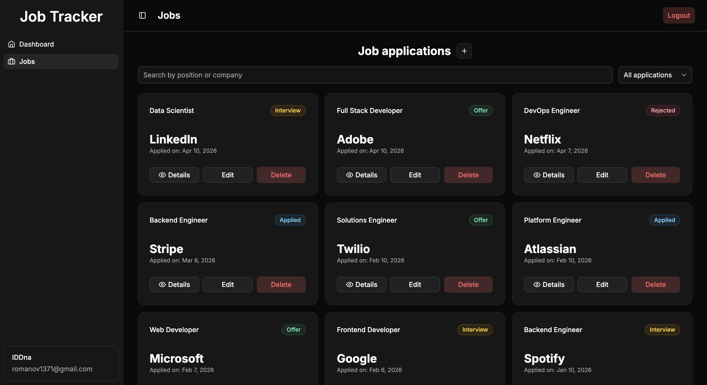

# 🚀 Job Tracker

A fullstack web application for tracking job applications, managing their statuses, and analyzing progress through a personal dashboard.

Built as a portfolio project to demonstrate fullstack development skills.

🔗 **Live Demo:** https://job-tracker-tau-ten.vercel.app

🔗 **Backend API:** https://job-tracker-9ogn.onrender.com

---

# ✨ Features

- 🔐 Authentication (JWT-based login & registration)
- 💼 Create, edit, delete job applications
- 📊 Dashboard with statistics (applications by status)
- 🔍 Filter and manage job listings
- 🧠 Persistent sessions (token-based auth)
- 🌐 Fully deployed (frontend + backend)

---

# 🧱 Tech Stack

## Frontend

- React
- TypeScript
- React Query
- Redux Toolkit
- TailwindCSS
- Shadcn UI
- Axios

## Backend

- Node.js
- Express
- TypeScript
- MongoDB (Mongoose)
- JWT Authentication

## Deployment

- Frontend: Vercel
- Backend: Render
- Database: MongoDB Atlas

---

# 📊 Dashboard Preview

<table border="0">
  <tr>
    <td>
      <p align="center"><b>Dashboard Stats</b></p>
      
    </td>
		<td>
      <p align="center"><b>Create & Edit Job Form</b></p>
      
    </td>
  </tr>
  <tr>
    <td colspan="2">
      <p align="center"><b>Jobs Listing</b></p>
      
    </td>
  </tr>
</table>

---

# 🧠 Architecture

```text
Client (React) → API (Express) → MongoDB
```

- REST API with protected routes
- JWT authentication middleware
- Aggregation pipeline for statistics

---

# 🔌 API Overview

## Auth

- POST `/api/auth/register`
- POST `/api/auth/login`

## Jobs

- GET `/api/jobs`
- GET `/api/jobs/user`
- GET `/api/jobs/:id`
- POST `/api/jobs`
- PUT `/api/jobs/:id`
- DELETE `/api/jobs/:id`

## Stats

- GET `/api/stats`

---

# ⚙️ Local Setup

## 1. Clone the repository

```bash
git clone https://github.com/romaleks/job-tracker.git
cd job-tracker
```

---

## 2. Backend setup

```bash
cd server
npm install
```

Create `.env` file:

```env
MONGODB_URI=your_mongodb_uri
JWT_SECRET=your_secret
```

Run server:

```bash
npm run dev
```

---

## 3. Frontend setup

```bash
cd client
npm install
npm run dev
```

---

# 💡 What I Learned

- Building a fullstack application end-to-end
- Designing REST APIs and working with MongoDB aggregation
- Managing server state with React Query
- Handling authentication with JWT
- Deploying fullstack apps (Vercel + Render)

---

# 📬 Contact

If you'd like to connect or discuss opportunities, feel free to reach out!

---
